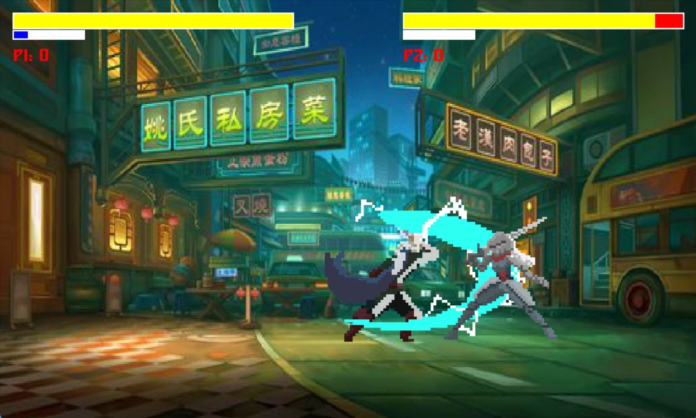

# KingdomFighter
KingdomFighter is a dynamic, real-time multiplayer fighting game developed using Pygame. The game features interactive combat mechanics, intuitive character selection, health management, and offers an engaging competitive experience for two players.

## Features
- Multiplayer Gameplay: Engage in exciting real-time combat, where two players can fight against each other.
- Character Selection: Players can choose their preferred characters before the battle begins.
- Combat Mechanics: Perform actions such as moving, jumping, and attacking with customizable controls.
- Health Management: Each player has a health bar, with damage tracked during combat.
- Responsive UI: The game interface is designed to be smooth and responsive for an immersive experience.
- Real-Time Action: Combat happens simultaneously, with each player making moves and attacks in real-time.

## Prerequisites
Before running the game, ensure that the following are installed on your system:
- Python 3.x: Download and install Python from the official website.
- Pygame: Install the Pygame library for game development using the command:
  ```
  pip install pygame
  ```
## Installation
1. Clone the repository:
  ```
  git clone https://github.com/Luan0901/KingdomFighter.git
  ```
2. Navigate to the project directory:
  ```
  cd KingdomFighter
  ```
3. Install dependencies:
  ```
  pip install pygame
  ```
4. Run the game:
- Execute the following command to start the game:
  
  ```
  python main.py
  ```
- This will launch the game, and you can start playing.

## Controls

### Player 1 (Left Side)
- **A, D**: Move Left/Right
- **W**: Jump
- **J**: Light Attack
- **K**: Heavy Attack
- **L**: Special Attack

### Player 2 (Right Side)
- **Left/Right Arrow**: Move Left/Right
- **Up Arrow**: Jump
- **Num 1**: Light Attack
- **Num 2**: Heavy Attack
- **Num 3**: Special Attack

## Screen shot
<div style="display:flex; gap: 10px;">
  
  
  
</div>


